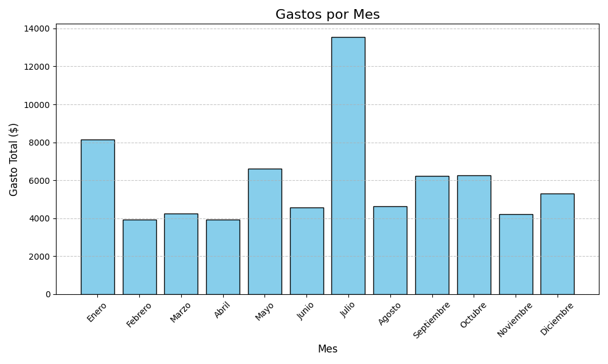
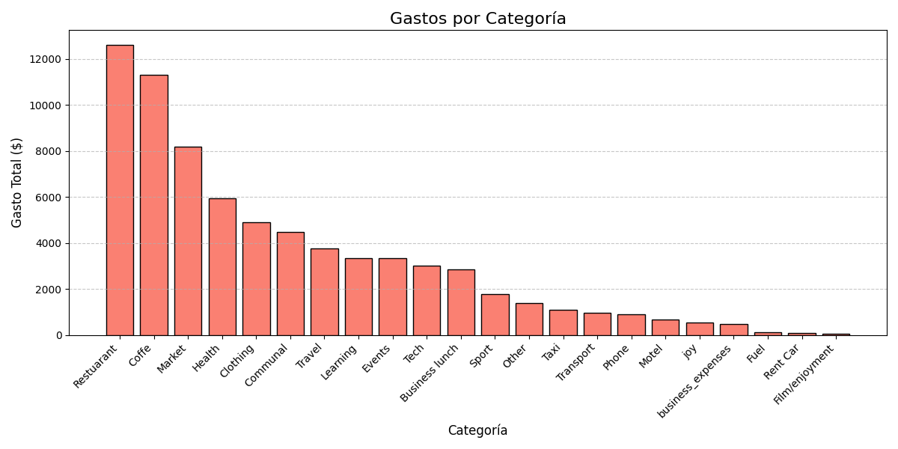
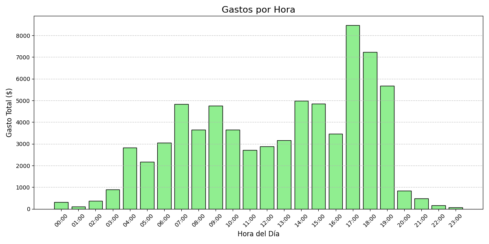

# Reporte de Análisis de Gastos

---

## 1. Descripción

Este documento presenta los resultados del análisis exploratorio realizado sobre un conjunto de datos de gastos.

El objetivo del análisis es identificar patrones de consumo, tendencias temporales y comportamientos relevantes en función de distintas dimensiones del dataset, como el tiempo y la categoría.

---

## 2. Resultados Principales

### 2.1 Año con mayor gasto
2024

---

### 2.2 Mes con mayor gasto
Julio

---

### 2.3 Día con mayor gasto
26

---

### 2.4 Hora con mayor gasto
17:00

---

### 2.5 Categoría con mayor gasto
Restaurant

---

## 3. Análisis

### 3.1 Tendencias generales

A nivel general se observa una tendencia de aumento del gasto a lo largo del tiempo, con valores mayores en los años más recientes.

Asimismo, los gastos se distribuyen en zonas marcadas del año, pudiéndose distinguir períodos asociados al verano y al invierno, lo que sugiere una posible estacionalidad en el comportamiento del consumo.

---

### 3.2 Patrones temporales

**Año:**  
En el dataset se observan cuatro años distintos: 2022, 2023, 2024 y 2025. Sin embargo, el año 2025 no se considera representativo debido a que no se encuentra completo.

Dentro de los años completos, se observa un incremento progresivo del gasto total año tras año.

**Mes:**  
Se observa que ciertos meses presentan niveles de gasto significativamente superiores al promedio. En particular, julio destaca como el mes con mayor gasto.

Estos picos podrían estar asociados a períodos vacacionales. Esto se refuerza al observar que durante estos meses la categoría "Travel" presenta valores elevados, lo que sugiere una relación entre el aumento del gasto y actividades de viaje.

**Día:**  
Los días del mes presentan en general una distribución relativamente equilibrada. Sin embargo, se identifican incrementos en ciertos rangos específicos, particularmente a comienzos de mes (días 1 a 3), hacia el final (a partir del día 26) y en el día 31.

Estos aumentos podrían estar asociados a pagos recurrentes, como servicios o suscripciones, aunque esto no puede confirmarse con certeza a partir de los datos disponibles.

**Hora:**  
Se observa que la mayor parte de los gastos se concentra entre las 17:00 y las 20:00, siendo las 17:00 la hora con mayor volumen.

Este patrón sugiere una mayor actividad de consumo fuera del horario laboral, posiblemente vinculada a actividades personales como alimentación, transporte o consumo recreativo. En contraste, las primeras horas del día presentan niveles de gasto considerablemente menores.

---

### 3.3 Comportamiento por categoría

Se observa una diferencia clara entre categorías en función de la frecuencia y el monto de las transacciones.

Por un lado, existen categorías con bajo gasto promedio por compra pero alta frecuencia, como "Market", que representan gastos cotidianos y recurrentes.

Por otro lado, categorías como "Travel" presentan un gasto promedio elevado pero con baja frecuencia, lo que indica gastos ocasionales de alto impacto.

En conjunto, esto sugiere la existencia de dos grandes tipos de consumo:
- gastos frecuentes de bajo monto
- gastos esporádicos de alto valor

Este comportamiento indica que el gasto total no depende únicamente del monto individual, sino también de la frecuencia de las transacciones.

---

## 4. Insights

- El gasto no se distribuye de manera uniforme, sino que se concentra en períodos específicos del año.
- Existe una tendencia creciente del gasto en el tiempo, especialmente en los años más recientes.
- Los picos mensuales parecen estar asociados a categorías específicas, principalmente vinculadas a viajes.
- El comportamiento del gasto muestra una separación clara entre consumo recurrente y consumo ocasional de alto impacto.
- La frecuencia de las compras tiene un impacto significativo en el gasto total acumulado.
- El gasto se concentra principalmente en horarios posteriores a la jornada laboral.

---

## 5. Limitaciones

- El dataset presenta inconsistencias en algunas categorías (por ejemplo, errores tipográficos como "Restuarant").
- No se dispone de información contextual adicional (ingresos, eventos personales, inflación), lo que limita la interpretación de los resultados.
- El uso del día del mes como variable puede mezclar comportamientos distintos entre meses.
- El año 2025 no se encuentra completo, por lo que no es representativo para el análisis.
- No es posible confirmar con certeza las causas de los patrones observados, ya que el análisis se basa únicamente en los datos disponibles.

---

## 6. Visualizaciones

### 6.1 Gastos por mes

---

### 6.2 Gastos por categoría

---

### 6.3 Gastos por hora

---